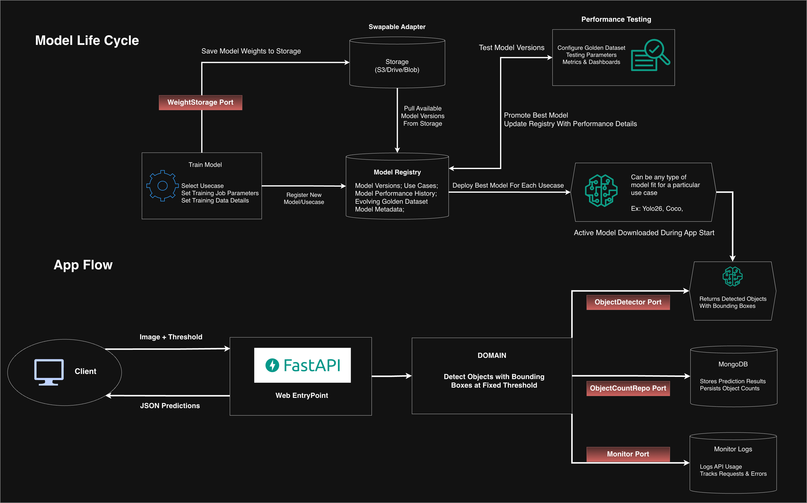
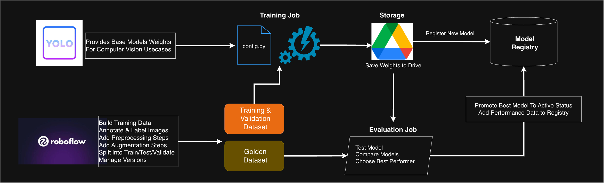
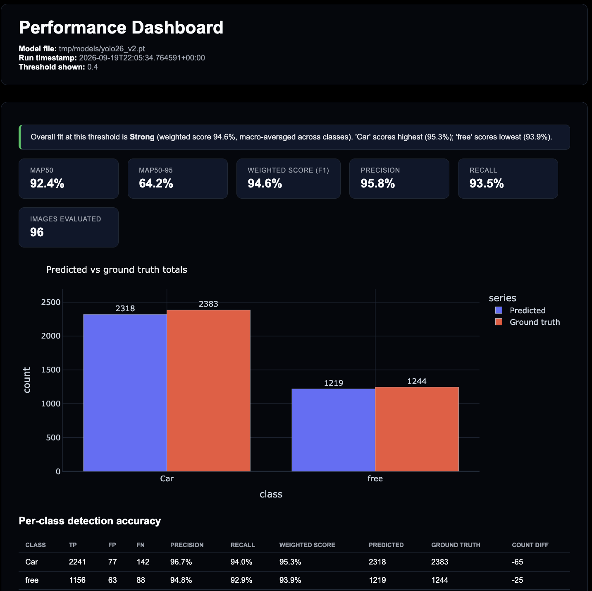
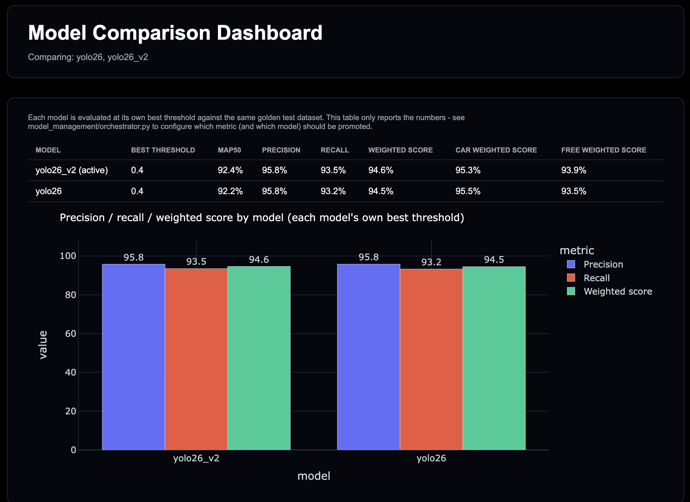
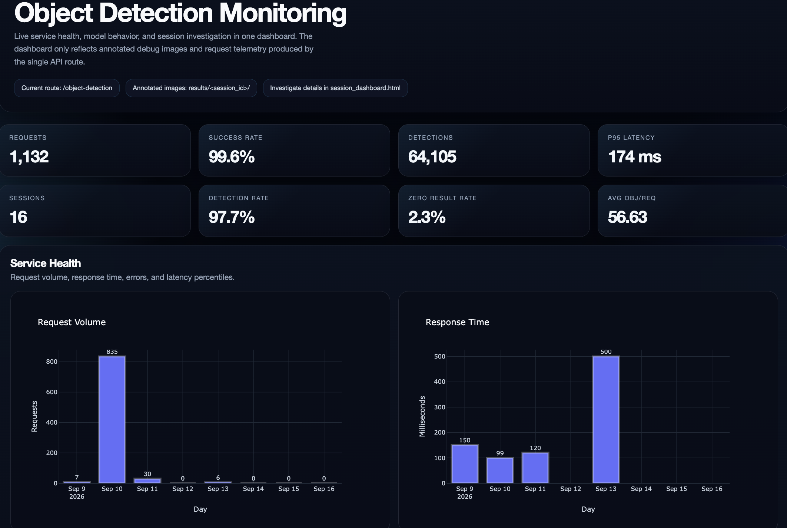
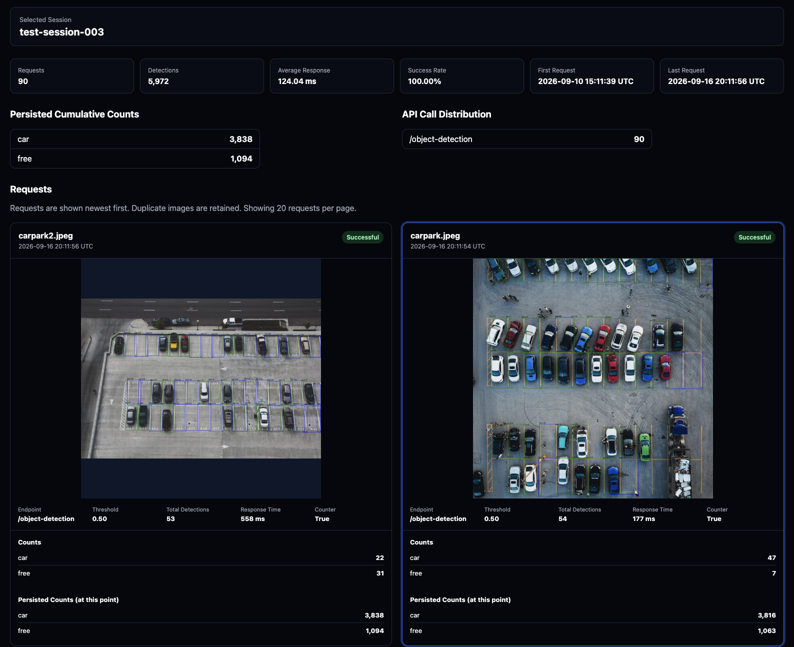
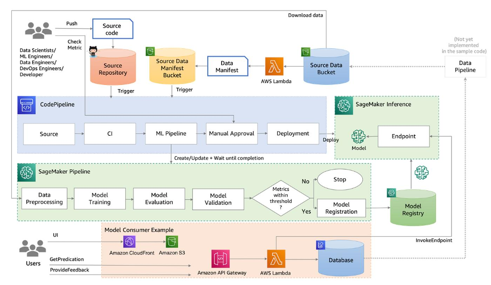
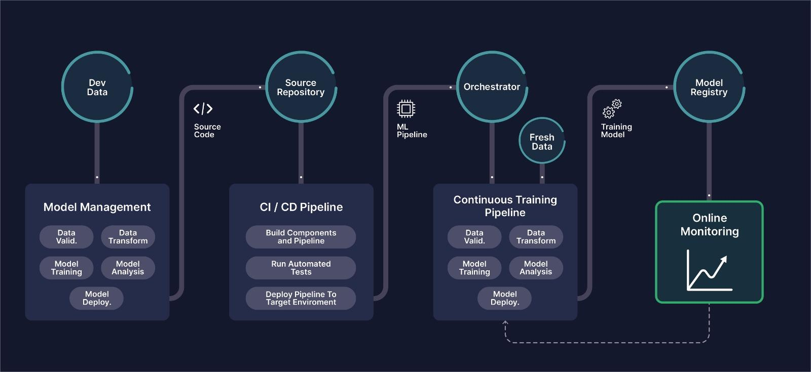

# Object Detection & Counter MLOps

**A production-oriented object detection and counting API that detects objects with bounding boxes, filters predictions by configurable confidence thresholds, and optionally tracks cumulative counts. Built with Hexagonal Architecture, keeping the core detection and counting logic independent from frameworks infrastructure, and external services - Allows for safe swaps.**

[](https://www.python.org/)
[](https://fastapi.tiangolo.com/)
[](https://www.ultralytics.com/)
[](https://www.mongodb.com/)
[](https://www.docker.com/)
[](https://pytest.org/)
[](#architecture)

[🏗️ Architecture](#-architecture) • [🚀 Quick Start](#-quick-start) • [🧩 Make It Yours](#-make-it-yours) • [📁 Project Structure](#-project-structure) • [📡 API](#-api) • [🤖 Model Training, Registry and Performance](#-model-training-registry-and-performance) • [🩺 Monitoring](#-monitoring) • [🧪 App Tests](#-app-tests)

---

## 🏗️ Architecture



**Hexagonal Architecture Benefits**

* 🔌 **Replaceable** — swap YOLO, MongoDB, or FastAPI independently, the domain doesn't notice
* 🧪 **Testable** — domain logic is tested with plain mocks, no model or database required
* 🧼 **Focused** — business rules (filter by confidence, count by class) live in one place, not scattered across the model or DB code

Model training happens locally with [`model_management/training/yolo_training/train.py`](model_management/training/yolo_training/train.py) (or the full pipeline in [`model_management/orchestrator.py`](model_management/orchestrator.py)), and the resulting weights are handed off through the [model registry](#the-registry) and [evaluation](#evaluation) before being promoted — see [Model Training, Registry and Performance](#-model-training-registry-and-performance) for the full workflow. The runtime side never needs to change to pick up a new model.

The current model detects **parking spaces** (`Car` / `Free`), but that's just configuration — the app itself doesn't know or care what it's counting. What a use case is even allowed to detect is itself config: [`model_management/config.py`](model_management/config.py) defines the required class list per use case (e.g. `carpark` -> `Car`/`Free`), and a dataset that doesn't match is refused before training ever starts.

---

## 🚀 Quick Start

**Prerequisites:** Python 3.10+, Docker, Make

```bash
git clone <this-repo>
cd object_detection-counter-hexagonal-mlops-architecture

make start
```

That's it. `make start` will:

1. Create the virtual environment and install dependencies
2. Download the active YOLO model
3. Spin up a MongoDB container in Docker
4. Launch the API at `http://localhost:5000`

Try it out:

```bash
curl -F "session_id=demo" \
     -F "threshold=0.5" \
     -F "counter=true" \
     -F "file=@resources/images/carlot.jpeg" \
     http://localhost:5000/object-detection
```
Want to send more than one image? [`scripts/api_test.py`](scripts/api_test.py) posts every image in a folder (default `resources/images/`) to `/object-detection` in one go — edit `IMAGE_DIR`, `SESSION_ID`, and `THRESHOLD` at the top of the file, then run:

```bash
python scripts/api_test.py
```

See what's happening — every request you just made is logged, so you track it by making the dashboard:

```bash
make dashboard monitoring   # is the API healthy? request volume, errors, response times
make dashboard session      # what happened in your session, step by step, with result images
```

---

## 🧩 Make It Yours

The domain layer only ever talks to **ports** (interfaces). Swap the **adapter** behind a port and everything else keeps working — no changes to business logic, tests are structured to make that safe.

| Tomorrow you want to... | What you touch |
|---|---|
| Use a different model (e.g. TensorFlow instead of YOLO) | Add a new `ObjectDetector` adapter implementing `predict()`, wire it in [`config.py`](counter/config.py) |
| Use a different database (e.g. PostgreSQL instead of MongoDB) | Add a new `ObjectCountRepo` adapter, wire it in [`config.py`](counter/config.py) |
| Detect something else entirely (people, defects, produce...) | Add a use case in [`model_management/config.py`](model_management/config.py) (its required classes), register a new model + classes in [`model_management/model_registry/registry.json`](model_management/model_registry/registry.json) — the domain never hardcodes `car`/`free` |

As long as your use case is *"send a photo in, get back detected classes and counts"*, the domain code in `counter/domain/` doesn't change at all.

---

## 📁 Project Structure

This repo has two main areas: the runtime app in `counter/` and the model lifecycle tooling in `model_management/`. The details below show how each part is laid out.

### `counter/`

This is the application — everything else in the repo supports it. It's four pieces, each with one job:

| Piece | Job |
|---|---|
| 🧠 **`domain/`** | The business logic — filtering by confidence, counting by class. Never imports from `adapters/` or `entrypoints/` |
| 🔌 **`adapters/`** | Swappable implementations the domain talks to — YOLO detector, MongoDB, request monitoring |
| 🌐 **`entrypoints/`** | How the outside world reaches it — the FastAPI app, a CLI runner |
| ⚙️ **`config.py`** | Wires the domain to the real adapters used by the app |

The rule that makes this work: **`domain/` never imports from `adapters/` or `entrypoints/`.** Dependencies only point inward, so swapping YOLO, MongoDB, or FastAPI never touches the business logic.

<details>
<summary>Full folder layout (for contributors)</summary>

```text
counter/
├── domain/          business logic — the part that actually matters
│   ├── actions.py      use cases (count objects, list objects)
│   ├── models.py       plain data models (Prediction, ObjectCount, ...)
│   ├── ports.py        interfaces the domain depends on
│   └── predictions.py  confidence filtering + counting rules
│
├── adapters/        implementations of those interfaces
│   ├── detection/       YOLODetector (+ a Fake one for dev/tests)
│   ├── database/        MongoDB-backed + in-memory count repos
│   └── monitoring/      MongoDB-backed request logging
│
├── entrypoints/     how the outside world reaches the domain
│   ├── webapp.py        FastAPI app
│   └── main.py          CLI runner
│
├── monitoring/      request-level logging orchestration
└── config.py        wires ports to adapters based on the app's runtime configuration
```

</details>

---

### `model_management/`

Everything to do with getting a new model into production lives here, kept separate from the runtime app in `counter/`. It's four pieces, each with one job:

| Piece | Job |
|---|---|
| ⚙️ **`config.py`** | The one place to change what to train on and how — dataset, required classes, hyperparameter defaults |
| 🧪 **`training/`** | Downloads the dataset and trains a model |
| 📊 **`evaluation/`** | Scores any model against the same fixed test set, so results are always comparable |
| 📋 **`model_registry/`** | Keeps a record of every trained model, and which one is currently live |

`orchestrator.py` ties them together — train → register → evaluate → promote — in one command. See [Model Training, Registry and Performance](#-model-training-registry-and-performance) below for how it all fits together.

<details>
<summary>Full folder layout (for contributors)</summary>

```text
model_management/
├── config.py             use cases + required classes, the Roboflow dataset to train/evaluate against, default training hyperparameters
├── orchestrator.py       scriptable train -> register -> evaluate -> promote pipeline; re-compares every registered model, not just the candidate, if the golden dataset changed
├── promotion.py          shared "does the candidate beat the active model on this metric" logic - no metric or class is hard-coded as "more important"
│
├── training/
│   └── yolo_training/
│       ├── dataset.py         RoboflowDatasetManager - downloads a dataset version into training_data/ + evaluation/golden_dataset, validated against config.py first
│       ├── trainer.py          YoloTrainer - wraps Ultralytics training/validation
│       ├── train.py            standalone CLI: download a dataset + train + register in registry.json (no evaluation/promotion)
│       └── training_data/     train/valid only (gitignored) - never contains the golden test split
│       (a future non-YOLO approach, e.g. tensorflow_coco_training/, would be its own sibling package here)
│
├── model_registry/
│   ├── registry.json   every trained model — name, use case, weights source, active flag, cached performance history keyed to the golden dataset version
│   ├── registry.py      add / list / download / promote models
│   ├── ports.py         WeightsStorage port - the interface registry.py/orchestrator.py/train.py depend on
│   └── drive.py         GoogleDriveStorage - the WeightsStorage implementation used today
│
└── evaluation/           one folder for everything evaluation/performance-related - a model is only ever evaluated one way
    ├── golden_dataset/   Roboflow's `test` split — real bounding-box labels, the one and only copy (gitignored)
    ├── dataset.py         golden dataset loading + version fingerprinting (includes class names, so relabeling counts as a new version)
    ├── scoring.py         domain-agnostic precision/recall/F1 from Ultralytics' IoU-matched confusion matrix
    ├── evaluator.py       runs a model through Ultralytics' validation pipeline against the golden dataset, logs to the registry
    ├── scripts/          thin CLI over evaluator.py (make performance_test)
    └── dashboard/        HTML dashboards (reporting only, no promotion logic) + compare_models.py CLI (make model_compare)

results/model_management/    performance results + training run artifacts (gitignored, regenerated on demand)
├── evaluation/                  one JSON + plots/ per evaluation run
└── training/runs/detect/       one folder per training run (weights, results.csv, plots)
```

</details>

---

## Everything Else, Briefly

| Folder | What it's for |
|---|---|
| `monitoring/` | Generates the operational HTML dashboards from MongoDB data |
| `scripts/` | Setup script + model downloader |
| `tests/` | Domain, integration, e2e, and entrypoint tests |
| `resources/` | Sample images and static assets used in this README |
| `results/` | Generated, not committed: API test-session captures (`scripts/api_test.py`) plus `model_management/evaluation/` and `model_management/training/` artifacts |
| `tmp/` | Generated, not committed: downloaded model weights, HTML dashboards, debug images |

---

## 📡 API

### `POST /object-detection`

One endpoint, one `counter` flag:

| `counter` | Behavior |
|---|---|
| `true` | Count objects by class, persist cumulative totals, return both |
| `false` (default) | Just list individual detections (class, score, box) |

**Request:** multipart form — `file` (required), `session_id` (required), `threshold` (default `0.5`), `counter` (default `false`)

```bash
# Count + persist
curl -F "session_id=lot-1" -F "threshold=0.5" -F "counter=true" \
     -F "file=@resources/images/carlot.jpeg" http://localhost:5000/object-detection

# Just list detections
curl -F "session_id=lot-1" -F "threshold=0.5" -F "counter=false" \
     -F "file=@resources/images/carlot.jpeg" http://localhost:5000/object-detection
```

<details>
<summary>Example responses</summary>

`counter=true`:

```json
{
  "current_objects": [{"object_class": "car", "count": 84}, {"object_class": "free", "count": 16}],
  "total_objects":   [{"object_class": "car", "count": 8420}, {"object_class": "free", "count": 1580}]
}
```

`counter=false`:

```json
[{"class_name": "car", "score": 0.94, "box": {"xmin": 120.4, "ymin": 85.2, "xmax": 315.7, "ymax": 264.1}}]
```

</details>

Every request — regardless of the `counter` flag — is logged to MongoDB (`detection_history`) for the [Monitoring](#-monitoring) dashboards below.

Testing against a single image gets old fast — [`scripts/api_test.py`](scripts/api_test.py) is a configurable script that loops over every image in a folder and calls this endpoint for each one, printing status and response for all of them.

---

## 🤖 Model Training, Registry and Performance

Every model, old or new, goes through the same three steps — **train → evaluate → promote** — so no model ever skips a check or gets judged differently from another.



> **Prerequisites — two free external accounts, both set in `.env`** (not needed just to run the API or view dashboards):
> - **[Roboflow](https://roboflow.com)** hosts the dataset a model is trained and evaluated against — `ROBOFLOW_API_KEY`.
> - **Google Drive** stores every trained model's weights so they can be re-downloaded later — `GOOGLE_DRIVE_CLIENT_ID` / `GOOGLE_DRIVE_CLIENT_SECRET` (an OAuth "Desktop app" client; `GOOGLE_DRIVE_FOLDER_ID` optional).

### Key commands

```bash
make train ARGS="--model-name experiment1"                          # train + upload to Drive + register (no evaluation yet)
make orchestrate ARGS="--model-name yolo26_v7"                       # full pipeline: train + register + evaluate + promote (if configured)
make performance_test                                                # score the active model against the test set
make performance_test MODEL_NAME=yolo26_v2                           # score a registered model by name (downloads it if needed)
make performance_test MODEL_PATH=tmp/models/my_experiment.pt         # score any local weights file, registered or not
make performance_dashboard                                           # view the most recently tested model's scores
make performance_dashboard MODEL=yolo26_v2                            # view one specific model's latest scores
make model_compare MODELS="yolo26 yolo26_v2"                         # score & compare specific models side by side
make model_comparison_dashboard                                      # view every compared model side by side
make model_promote MODEL=yolo26_v2                                   # manually switch which model is active
```

What gets trained and evaluated against — the dataset, the required classes, training defaults — is all set in one place: [`model_management/config.py`](model_management/config.py). Every command above accepts optional flags (`--epochs`, `--roboflow-version`, etc.) that override those defaults for a single run.

### The Registry

[`model_management/model_registry/registry.json`](model_management/model_registry/registry.json) is the record of every model ever trained: where its weights are, whether it's currently active, and its latest scores. The API always serves whichever model is marked active — promoting a model is just flipping that flag, no code changes or redeploy needed.

The generated dashboards live under `tmp/dashboard/` when you run the commands above.

<table>
<tr>
<td><br><sub>Performance dashboard</sub></td>
<td><br><sub>Model comparison dashboard</sub></td>
</tr>
</table>

<details>
<summary>How it works, in detail (for contributors)</summary>

#### Training

Dataset handling and training are plain Python classes ([`model_management/training/yolo_training/dataset.py`](model_management/training/yolo_training/dataset.py)'s `RoboflowDatasetManager`, [`model_management/training/yolo_training/trainer.py`](model_management/training/yolo_training/trainer.py)'s `YoloTrainer`), imported by both `train.py` and `orchestrator.py` so the logic is never duplicated. They live inside `yolo_training/` rather than `training/` directly since they're YOLO/Roboflow-specific; a future non-YOLO training approach would bring its own sibling package instead of reusing them.

Before any file is written, the downloaded dataset's class names are checked against `--use-case`'s required classes (default `carpark` -> `Car`/`Free`, see [`model_management/config.py`](model_management/config.py)) - a mismatch is a hard stop, so a wrong or relabeled dataset can never partially overwrite `training_data/`/`golden_dataset/`. Adding a second use case (a different kind of model entirely) is just a new entry in that file; the registered model is tagged with its use case so the two are never compared or mixed up.

The full pipeline (`make orchestrate`) does:

1. Pull the training dataset from Roboflow — `train`/`valid` go to `model_management/training/yolo_training/training_data/`, Roboflow's own `test` split goes to `model_management/evaluation/golden_dataset/` (the *only* copy of the test set — training never sees it)
2. Train the model
3. Copy the trained weights locally and upload them — plus the training run's own artifacts (`results.csv`, plots, `args.yaml`) — to Google Drive, then register the new model in `registry.json` (not active yet) — this registration step always happens, for both `train.py` and `orchestrator.py`, so every trained model is trackable the moment it exists
4. Evaluate it against the golden dataset (see below)
5. If the golden dataset turned out to have changed since the last run (a new Roboflow version, or a relabeling that changed the class names), every registered model is re-tested and ranked together — not just this one — so a dataset change never gets compared against stale results; otherwise it's a straight candidate-vs-active comparison. Either way, promotion only happens if configured to

Evaluation reports are **never** uploaded to Drive — only trained weights and training artifacts are. Once a model is registered, its Drive link is all that's needed to fetch it again later.

#### Evaluation

[`model_management/evaluation/`](model_management/evaluation/) is the single place every model — new or old — gets scored, so results are always comparable. Performance testing and evaluation are the same thing in this repo — there's exactly one folder for it, not two.

1. [`model_management/evaluation/golden_dataset/`](model_management/evaluation/golden_dataset/) holds the held-out `test` split with real bounding-box labels
2. [`model_management/evaluation/evaluator.py`](model_management/evaluation/evaluator.py) runs the model through Ultralytics' own validation pipeline at each configured confidence threshold. Ultralytics' confusion matrix already matches predicted boxes to ground-truth boxes by IoU (see `IOU_MATCH_THRESHOLD` in [`model_management/evaluation/scoring.py`](model_management/evaluation/scoring.py)) — a prediction only counts as correct if its box is actually close enough to a real one, not just if the counts happen to match
3. [`model_management/evaluation/scoring.py`](model_management/evaluation/scoring.py) turns that confusion matrix into plain, domain-agnostic metrics per class — precision, recall, F1 (`weighted_score`) — with no class or metric hard-coded as more important than another
4. Results are saved to `results/model_management/evaluation/` and logged to the model's entry in the registry, keyed to a golden dataset version fingerprint that includes the class names themselves — relabeling the dataset (e.g. `car`/`free` -> `busy`/`free`) counts as a new version, so a re-run doesn't compare incompatible results as if nothing changed, and a stale model is automatically re-tested rather than shown side by side with mismatched classes. Each cached result also records which Roboflow project/version it was scored against, for future reference.

The dashboards only **report** metrics — precision, recall, weighted_score, per-class breakdowns — they never declare a "winner" or bake in which class matters more. Deciding whether a candidate is good enough to promote is a judgment call left to whoever reads the dashboard (or to `--auto-promote`/`PROMOTE_WINNER` if you want that judgment automated on a metric you chose). Scores are cached on each model's registry entry, keyed to the golden dataset version, so re-running doesn't re-test a model unless the dataset changed or `--retest` is passed.

```bash
make performance_dashboard                     # view precision/recall/weighted_score for the most recently tested model
make performance_dashboard MODEL=yolo26_v2     # view a specific model's own latest result
make model_comparison_dashboard                 # view all compared models side by side
```

#### Registry & Promotion

[`model_management/promotion.py`](model_management/promotion.py) is the one shared place that decides "does the candidate beat the active model" — on `precision`, `recall`, or `weighted_score` (default), whichever you choose. It's used identically by `orchestrator.py` and `compare_models.py` (`train.py` only trains + registers — it doesn't evaluate or promote), so promotion logic never has to be re-implemented or re-guessed.

```bash
make model_list                                     # see what's registered + downloaded, incl. use case
make model_download                                 # fetch every registered model
make model_download_active                          # fetch only the active model (what `make start` does)
make model_compare MODELS="yolo26 yolo26_v2" PROMOTE=1  # score, then promote the winner
```

Model names typed anywhere (`MODEL`, `MODELS`, `MODEL_NAME`) tolerate a trailing `.pt` or a pasted `[yolo26.pt](...)` markdown link — both resolve to `yolo26`.

</details>

---

## 🩺 Monitoring

Monitoring is the opposite concern: it doesn't care if the model is *accurate*, only whether the running API is *behaving* — request volume, errors, response times. It's built from live request logs, not ground truth.

Every call to `/object-detection` is written to the `detection_history` collection in MongoDB, regardless of which model is active. The dashboards in [`monitoring/`](monitoring/) read straight from that collection, generated on demand as self-contained HTML under `tmp/dashboard/`.

```bash
make dashboard monitoring   # KPIs, request volume, error rate, response times across all sessions
make dashboard session      # step-by-step trace of one session, with annotated result images
```

The generated monitoring dashboards live under `tmp/dashboard/` when you run the commands above.

<table>
<tr>
<td><br><sub>Monitoring dashboard</sub></td>
<td><br><sub>Session dashboard</sub></td>
</tr>
</table>

---

## 🧪 App Tests

Regular pytest suite covering the application's own code — domain logic, database persistence, and the HTTP API contract.

| Layer | Command | What it checks |
|---|---|---|
| Domain | `make test_domain` | Filtering/counting rules, mocked ports — no infra needed |
| Integration | `make test_integration` | Real MongoDB persistence |
| Entrypoints | `make test_entrypoints` | HTTP contract of `/object-detection`, incl. validation errors |
| E2E | `make test_e2e` | Full pipeline: image in → API → model → DB → response |

Run it all during setup:

```bash
make test
```

---

## 🧭 Scope & Design Trade-offs

This is a solo project built to demonstrate a hexagonal MLOps architecture end-to-end — a **production-oriented architecture demonstration**, not production infrastructure. A few shortcuts were made because it's a personal project, and each one is a swappable adapter or config choice rather than something baked into the domain:

| Shortcut taken here | What it stands in for at scale | Why it's swappable |
|---|---|---|
| Weights stored in **Google Drive** ([`drive.py`](model_management/model_registry/drive.py), behind the [`WeightsStorage`](model_management/model_registry/ports.py) port) | Object storage (S3/GCS/Azure Blob) | Swapping to S3 is a new `WeightsStorage` implementation, not a change to `registry.py`/`orchestrator.py`/`train.py` |
| **`registry.json`** as the model registry | A real registry/database (MLflow, SageMaker Model Registry, Postgres) | Fine for a handful of models; `registry.py` is the only place that would need to change if this grew |
| No CI/CD, image build, or orchestrated deployment (Docker Compose only) | GitHub Actions → container build → registry → Kubernetes/ECS/Cloud Run | See the reference diagrams below for what that looks like on top of this same train → registry → evaluate → promote flow |
| **Operational monitoring only** — request volume, latency, errors ([`monitoring/`](monitoring/)) | ML monitoring — data/prediction/confidence drift, model degradation over time | Current dashboards answer "is the API up", not "is the model still accurate"; that would mean tracking predictions against the golden dataset over time, not just request logs |

<table>
<tr>
<td><br><sub>Reference: an AWS SageMaker CI/CD pipeline</sub></td>
<td><br><sub>Reference: generic MLOps maturity flow (repo → orchestrator → registry → online monitoring)</sub></td>
</tr>
</table>

---

## ⚙️ Configuration

Set via `.env` (created automatically from `.env.example` on first `make start`):

```env
MONGO_HOST=localhost
MONGO_PORT=27017
MONGO_DB=counter
MODEL_PATH=tmp/models/yolo26.pt   # optional override — otherwise uses the registry's active model
```

This repo always uses the real app wiring. If Docker or MongoDB is not available, `make start` will fail and you need to fix that on your machine before continuing.

Model management:

```bash
make model_list                     # see what's registered + downloaded
make model_download                 # fetch the active model
make model_promote MODEL=yolo26_v2  # switch the active model
```
